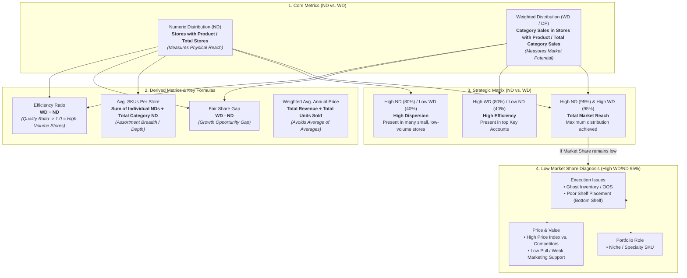

# 06. FMCG Distribution System Diagram

This page contains the architecture diagram for Go-To-Market distribution analytics, ready for rendering natively in Markdown tools, GitHub, or importing into **Excalidraw**.

---

## 1. Mermaid System Architecture

---

## 2. How to Import to Excalidraw

1. Copy the raw Mermaid code block above.
2. Open [Excalidraw](https://excalidraw.com/).
3. Open **More Tools** (`+` icon on top bar) $\rightarrow$ **Mermaid to Excalidraw**.
4. Paste the code and click **Insert**.